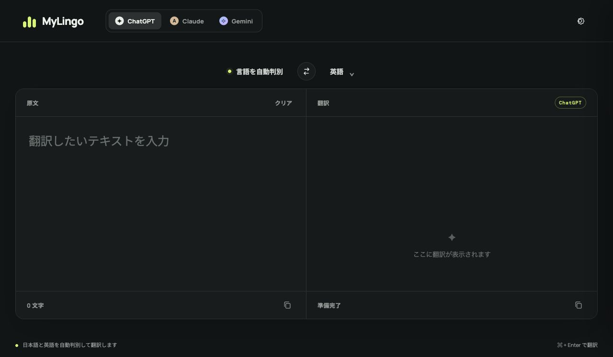

# MyLingo

ChatGPT、Claude、Gemini を切り替えて使える、日本語・英語向けのシンプルなブラウザ翻訳ツールです。



## 特長

- 日本語・英語を自動判別し、もう一方の言語へ翻訳
- ChatGPT / Claude / Gemini の切り替え
- 翻訳結果を左側の原文欄にコピーする入れ替えボタン
- 入力から少し待つだけで自動翻訳（`⌘ / Ctrl + Enter` でも実行）
- APIキーとモデル名をブラウザの `localStorage` にだけ保存
- ビルド不要の静的サイト。サーバーへデータを保存しません

## サーバーについて

アプリ本体にバックエンドサーバーは必要ありません。HTML、CSS、JavaScriptだけで動く静的サイトで、翻訳時はブラウザが各AIサービスのAPIへ直接アクセスします。

公開時はGitHub Pages、Netlify、Vercelなどの静的ホスティングへそのまま配置できます。

## 使い方

1. 右上の設定（歯車）を開きます。
2. 使いたいサービスを選択し、そのサービスのAPIキーを入力します。
3. 必要に応じてモデル名を変更し、「保存する」を押します。
4. 左の欄に日本語または英語を入力します。

| サービス | 初期モデル |
| --- | --- |
| ChatGPT | `gpt-5.6-luna` |
| Claude | `claude-haiku-4-5-20251001` |
| Gemini | `gemini-3.5-flash-lite` |

## APIキーについて

このアプリはバックエンドを持たず、ブラウザから各AIサービスのAPIへ直接リクエストします。APIキーは `localStorage` に保存され、リポジトリに含まれることはありません。

> **注意:** ブラウザアプリにAPIキーを保存する方式は、個人利用・ローカル利用を想定しています。第三者が利用する公開サイトとしてデプロイする場合は、APIキーを保護するサーバーサイドのプロキシを用意してください。

## ファイル構成

```
.
├── index.html   # 画面構造
├── styles.css   # レスポンシブなダークUI
└── app.js       # 翻訳・設定・各API接続
```
