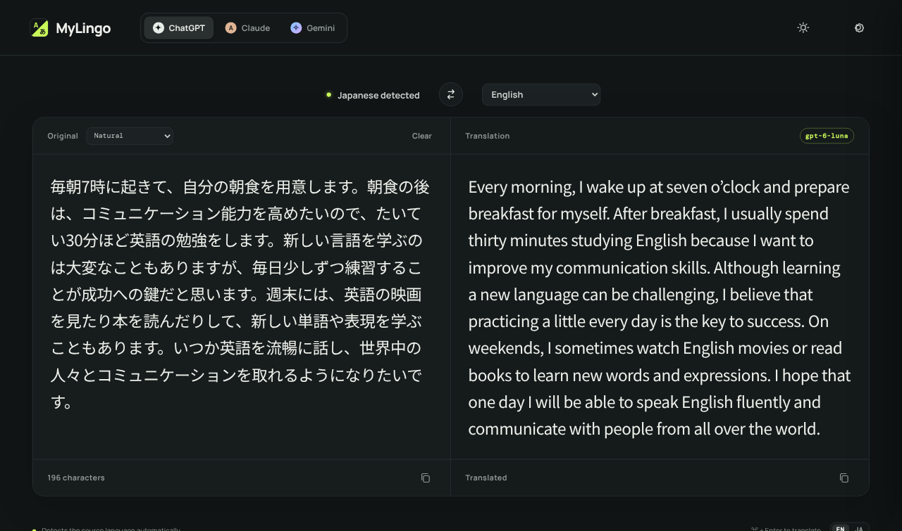
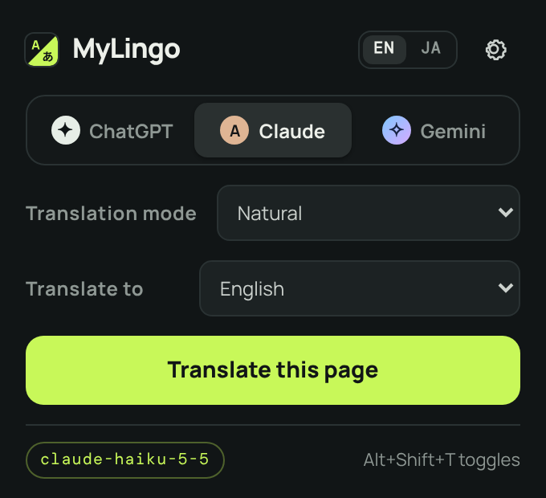

# MyLingo

ChatGPT、Claude、Gemini を切り替えて使える、日本語・英語向けのシンプルなブラウザ翻訳ツールです。



## 特長

- 原文の言語は自動判別。翻訳先はドロップダウンで選択（初期値は英語）し、一覧にない言語は「その他」で自由に入力
- ChatGPT / Claude / Gemini の切り替え
- ライトモードとダークモードを切り替え可能
- 翻訳モードを選択可能（原文に忠実 / ネイティブらしい自然な訳 / ビジネス文書向け / 会話・SNS向け / 技術文書向け）
- 原文と翻訳の入れ替えボタン（両欄の内容と翻訳先の言語を入れ替え）
- 入力から少し待つだけで自動翻訳（`⌘ / Ctrl + Enter` でも実行）
- APIキーとモデル名をブラウザの `localStorage` にだけ保存（APIキーはパスキーまたはパスフレーズで暗号化可能）
- ビルド不要の静的サイト。サーバーへデータを保存しません

## サーバーについて

アプリ本体にバックエンドサーバーは必要ありません。HTML、CSS、JavaScriptだけで動く静的サイトで、翻訳時はブラウザが各AIサービスのAPIへ直接アクセスします。

### localhost で開く

`index.html` をファイルとして直接開いても使えますが、APIキーをパスキー（Touch ID など）で暗号化するには、https か `http://localhost` で開く必要があります。手元で使う場合は、リポジトリのフォルダで次のどちらかを実行し、ブラウザで `http://localhost:8000` を開いてください。

```sh
# Python（macOS には標準で入っています）
python3 -m http.server 8000 --bind 127.0.0.1

# Node.js
npx serve -l 8000
```

止めるときはターミナルで `Ctrl + C` を押します。

- アドレスは `http://127.0.0.1:8000` ではなく `http://localhost:8000` を使ってください。IPアドレスではパスキーを使えません。
- 設定（APIキーなど）は開き方ごとに別々に保存されます。ファイルとして開いていたときの設定は引き継がれないので、入力し直してください。ポート番号を変えた場合も同様です。

## 使い方

1. 使いたいサービス（ChatGPT / Claude / Gemini）を選択します。
2. 右上の設定（歯車）を開き、選択中のサービスのAPIキーを入力します。
3. 必要に応じてモデル名を変更し、「保存する」を押します。
4. 「原文」欄の左上で翻訳モードを選択します（省略時は「原文に忠実」）。
5. 左の欄に日本語または英語を入力します。

| サービス | 初期モデル |
| --- | --- |
| ChatGPT | `gpt-6-luna` |
| Claude | `claude-haiku-5-5` |
| Gemini | `gemini-3.5-flash-lite` |

### コミットハッシュの表示

Webアプリの設定パネルと拡張機能の設定画面の下部に、動いているコードのコミットハッシュが表示されます。ハッシュは git フックが `extension/lib/version.js`（git管理外）に書き出すので、クローン後に一度だけ次を実行してください。以降はコミット・チェックアウト・pull のたびに自動で更新されます。

```sh
git config core.hooksPath .githooks && .githooks/write-version
```

## Chrome拡張機能（Webページ翻訳）

`extension/` フォルダには、表示中のWebページをまるごと翻訳するChrome拡張機能が入っています。Webアプリと同じく ChatGPT / Claude / Gemini を切り替えて使えます。



### 主な機能

- ツールバーのポップアップから「このページを翻訳」「原文に戻す」を切り替え
- ChatGPT / Claude / Gemini の切り替え、翻訳モードの選択（Webアプリと同じ5種類）
- 翻訳先はWebアプリと同じ一覧から選択（初期値は英語）し、一覧にない言語は「その他」で自由に入力
- 表示中の部分から順に翻訳し、スクロールに合わせて続きを順次翻訳（ページ全体を一度に送らないので速く、APIの消費も少ない）
- 「もっと見る」などで後から表示された内容も自動で翻訳
- 1分あたりのリクエスト数を制限でき、429（利用上限）エラー時はサービスが指定する待ち時間の後に自動で再試行
- テキストを選択して右クリック →「MyLingo で翻訳」で、選択部分だけを吹き出しに翻訳表示
- `Alt + Shift + T` で翻訳 / 原文に戻す を切り替え
- 入力欄・コードブロック・`translate="no"` / `.notranslate` の要素は翻訳しない

### インストール

1. Chromeで `chrome://extensions` を開き、右上の「デベロッパーモード」をオンにします。
2. 「パッケージ化されていない拡張機能を読み込む」を押し、このリポジトリの `extension` フォルダを選択します。
3. ツールバーの MyLingo アイコン → 歯車から設定画面を開き、使うサービスのAPIキー（必要ならモデル名も）を入力して保存します。

拡張機能の設定は `chrome.storage.local` に保存されるため、Webアプリとは別に入力が必要です。

リポジトリを更新（pull・ブランチの切り替えなど）したら、`chrome://extensions` で MyLingo の再読み込みボタン（↻）を押してください。ポップアップや設定画面は開くたびに新しいファイルを読み込みますが、翻訳を行うバックグラウンド（Service Worker）は再読み込みするまで古いコードのまま動くため、食い違いでエラーになることがあります。再読み込みするとAPIキーの暗号化のロックも掛かり直します。

### Gemini の無料枠について

Gemini APIの無料枠には1分あたりのリクエスト数の上限（例: `gemini-3.5-flash-lite` は 15回/分）があります。拡張機能は初期設定で Gemini へのリクエストを 12回/分 に抑え、上限に達した場合も待ってから自動で再試行します。それでもエラーになる場合は、設定画面の「1分あたりの最大リクエスト数」を下げてください。1日あたりの上限に達した場合は、翌日まで待つか有料プランに切り替える必要があります。

### しくみ

ページのテキストを要素ごとに取り出し、画面内（と少し先）に入った部分だけを、画面に近い順にまとめてAIへ送って翻訳結果に差し替えます（HTMLの構造は変えません）。APIへの通信は拡張機能のバックグラウンド（Service Worker）から行うため、閲覧中サイトの設定に影響されません。ページへのアクセス権は `activeTab` のみで、翻訳を実行したタブにだけ一時的に許可されます。

## APIキーについて

このアプリはバックエンドを持たず、ブラウザから各AIサービスのAPIへ直接リクエストします。APIキーは `localStorage` に保存され、リポジトリに含まれることはありません。

### APIキーの暗号化

設定画面の「APIキーの暗号化」で、APIキーの保存方法を「暗号化しない（初期設定）」「パスキーで暗号化」「パスフレーズで暗号化」から選べます（Webアプリ・拡張機能とも）。あとから別の方法に変えることもできます（ロック解除中のみ）。

- **パスキー（Touch ID など）**: WebAuthn の PRF 拡張で認証器から暗号鍵を取り出します。Chrome 116 以降・Safari 18 以降で、対応する認証器が必要です。Webアプリは https（ドメイン名）または `http://localhost` で開いたときだけ使えます（`index.html` をファイルとして直接開いた場合は使えません）。
  - 1Password などのパスワード管理ツールは、拡張機能の設定画面（`chrome-extension://`）用のパスキーを保存できないことがあります（「パスキーを保存できません」と表示される）。その場合は次のどれかを試してください。
    - パスワード管理ツールの画面でセキュリティキーなど別の方法を選び、ブラウザ標準の画面で Touch ID を使って作成する（パスキーは Chrome または iCloud キーチェーンに保存されます）。
    - 1Password の設定（ツールバーのアイコンを右クリック →「設定」→「自動入力と保存」）で「Offer to save and sign in with passkeys」（パスキーの保存とサインインを提案する項目）を一時的にオフにして作成する。ロック解除のときも同じ設定が必要になる場合があります。
    - パスフレーズで暗号化し、パスフレーズを 1Password に保管する。
- **パスフレーズ**: PBKDF2（SHA-256、60万回）で暗号鍵を作ります。パスキーを使えない環境向けです。

キーは AES-GCM で暗号化され、平文のキーは保存されなくなります。Webアプリはページを開くたびに、拡張機能はブラウザを起動するたびに（設定画面で）ロックの解除が必要です。拡張機能は解除したキーをブラウザを閉じるまで `chrome.storage.session`（メモリ上）に保持します。ロック中に翻訳しようとすると、そのままロック解除が始まり（パスキーなら認証画面、パスフレーズなら入力欄）、解除すると翻訳を続けます。Webアプリは翻訳欄で解除します。拡張機能は、パスフレーズならポップアップで、パスキーなら自動で開く小さな解除用ウィンドウで解除します（Chrome はパスキーの認証画面を出すとポップアップを閉じてしまうため）。パスキーをなくしたりパスフレーズを忘れたりすると復号できないため、キーそのものは 1Password やキーチェーンにも保管しておいてください。

暗号化で防げるのは、ブラウザの保存データを読まれたりコピーされたりした場合です。ロック解除中にページへ悪意あるスクリプトが入り込んだ場合（XSS）は防げません。

> **注意:** ブラウザアプリにAPIキーを保存する方式は、個人利用・ローカル利用を想定しています。
> `localStorage` はブラウザごとに分離されますが、公開サイトにするとコード改ざんやXSSが起きた際に全利用者のキーが一斉に漏洩するリスクがあります。

## ファイル構成

```
.
├── index.html   # 画面構造
├── styles.css   # レスポンシブなダーク/ライトUI
├── app.js       # 翻訳・設定・各API接続
├── .githooks/   # コミットハッシュを version.js に書き出すフック
└── extension/   # Chrome拡張機能（Webページ翻訳）
    ├── manifest.json
    ├── background.js    # API呼び出し・右クリックメニュー・ショートカット
    ├── content.js       # ページ内テキストの抽出・差し替え・選択翻訳の吹き出し
    ├── popup.html/js    # ツールバーのポップアップ
    ├── options.html/js  # APIキー・モデルの設定画面
    ├── ui.css
    ├── lib/             # サービス設定・翻訳リクエスト・APIキーの暗号化（vault.js はWebアプリと共用）
    └── icons/
```
